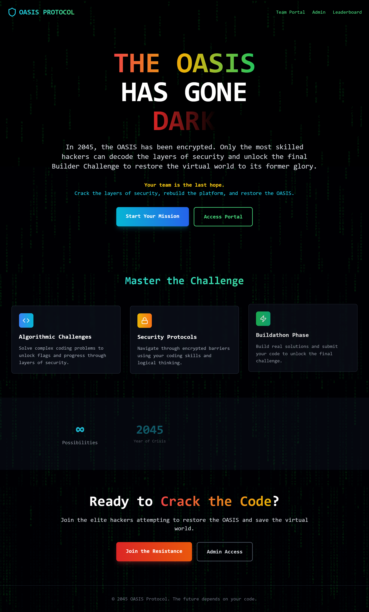
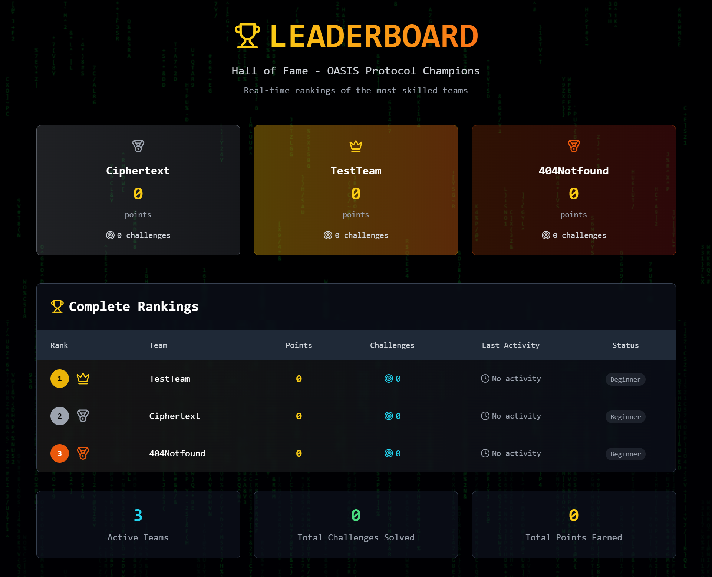
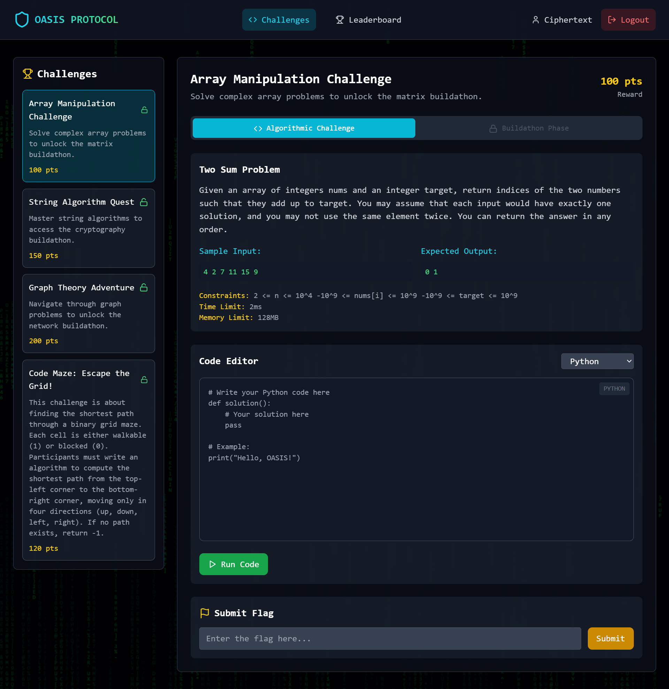

# Oasis Protocol Platform

A modern web platform for managing algorithmic problems, buildathon challenges, and team competitions, developed for the Duothan Hackathon Challenge 2025. The platform provides a comprehensive solution for organizing and managing competitive programming events, buildathons, and team-based challenges.

## 💡 Overview

Oasis Protocol Platform is designed to facilitate:
- Competitive Programming Contests
- Team-based Hackathons
- Buildathon Challenges
- Real-time Performance Tracking
- Automated Submission Evaluation
- Interactive Leaderboards

## 🎯 Purpose
- Provide a robust platform for conducting programming competitions
- Enable fair and transparent evaluation of submissions
- Foster collaboration through team-based challenges
- Offer real-time feedback and performance metrics
- Support both individual and team-based competitions

## 🚀 Features

### User Authentication & Authorization
- Secure JWT-based authentication system
- Role-based access control (Admin, User, Team Leader)
- Email verification system
- Password encryption using BCrypt
- Session management and token refresh

### Challenge Management System
#### Algorithmic Problems
- Multiple difficulty levels (Easy, Medium, Hard)
- Automatic test case validation
- Custom input/output support
- Time and space complexity constraints
- Multiple programming language support

#### Buildathon Problems
- Project submission system
- Multiple evaluation criteria
- Resource limitation monitoring
- Project documentation support
- Version control integration

#### Team-based Challenges
- Collaborative problem solving
- Team progress tracking
- Resource sharing capabilities
- Inter-team communication features

### Team Management
- Team creation and invitation system
- Role assignment within teams
- Team size management
- Team performance analytics
- Resource allocation tracking

### Submission Handling
- Real-time submission status
- Automated code evaluation
- Performance metrics tracking
- Submission history
- Code similarity detection
- Detailed feedback system

### Real-time Leaderboard
- Live score updates
- Multiple ranking criteria
- Performance visualization
- Historical performance tracking
- Team and individual rankings

### Admin Dashboard
- User management interface
- Challenge creation and management
- System performance monitoring
- Analytics and reporting
- Access control management
- Event scheduling system

### Flag System
- Secure flag validation
- Point distribution system
- Progress tracking
- Achievement unlocking
- Anti-cheating measures

## 🖼️ User Interfaces

Home

<p align="center">  </p>

Leaderboard

<p align="center">  </p>

Team Register

<p align="center">  </p>

Team Login

<p align="center">  </p>

Challenges

<p align="center">  </p>

Admin Login

<p align="center">  </p>

Challenge Management

<p align="center">  </p>

Team Management

<p align="center">  </p>


## 🛠️ Technology Stack

### Backend (.NET 8.0)
- ASP.NET Core Web API
- Entity Framework Core
- SQL Server
- JWT Authentication
- BCrypt for password hashing
- Identity Framework

### Frontend (React)
- React 19.1
- React Router DOM
- Tailwind CSS
- Framer Motion
- Recharts for data visualization
- Axios for API communication
- React Hot Toast for notifications

## 📦 Project Structure

```
├── Back-end/
│   ├── Controllers/       # API endpoints
│   ├── Data/             # Database context
│   ├── DTOs/             # Data transfer objects
│   ├── Models/           # Database entities
│   ├── Services/         # Business logic
│   └── Properties/       # Configuration files
└── Front-end/
    ├── public/           # Static files
    └── src/
        ├── components/   # Reusable UI components
        ├── contexts/     # React contexts
        ├── pages/        # Page components
        └── services/     # API services
```


## Team Members

<div align="left">

|  |  |
|:-------------------------:|:-------------------------:|
| **Lakshitha Wijerathne** | **Jayani Adikari** |
| [@mlswijerathne](https://github.com/mlswijerathne) | [@JMAdikari](https://github.com/JMAdikari) |

</div>

## 🤝 Contact

Lakshitha Wijerathne - [GitHub Profile](https://github.com/mlswijerathne)

Jayani Adikari - [GitHub Profile](https://github.com/JMAdikari)


